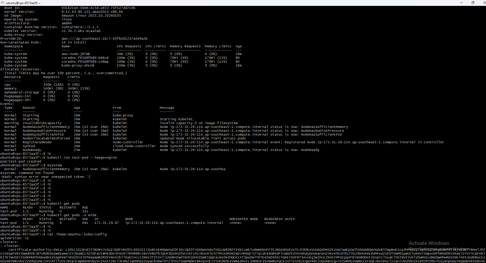

# AWS EKS Minimal Cluster Setup

This document records the steps to create a minimal EKS cluster and node group using the AWS CLI, based on the setup flow performed.

## 1. Prepare Network Resources

Retrieve available subnets for the cluster:

```bash
aws ec2 describe-subnets \
    --filters "Name=default-for-az,Values=true" \
    --query "Subnets[0:2].SubnetId" --output text
```

*Note: In this setup, we used `subnet-09410e49baa85c77e` and `subnet-0cea6ccf71894e950`.*

## 2. Create Cluster IAM Role

Create the trust policy `eks-trust-policy.json`:

```json
{
  "Version": "2012-10-17",
  "Statement": [
    {
      "Effect": "Allow",
      "Principal": {
        "Service": "eks.amazonaws.com"
      },
      "Action": "sts:AssumeRole"
    }
  ]
}
```

Create the role and attach the necessary policy:

```bash
aws iam create-role \
    --role-name MyMinimalEksRole \
    --assume-role-policy-document file://eks-trust-policy.json

aws iam attach-role-policy \
    --role-name MyMinimalEksRole \
    --policy-arn arn:aws:iam::aws:policy/AmazonEKSClusterPolicy
```

## 3. Create EKS Cluster

Create the cluster (version 1.34) using the role and subnets prepared above:

```bash
aws eks create-cluster \
   --name my-minimal-cluster \
   --role-arn arn:aws:iam::531906857012:role/MyMinimalEksRole \
   --resources-vpc-config subnetIds=subnet-09410e49baa85c77e,subnet-0cea6ccf71894e950 \
   --region ap-southeast-1
```

Wait for the cluster status to become `ACTIVE`:

```bash
aws eks describe-cluster --name my-minimal-cluster --query "cluster.status"
```

## 4. Create Node Group IAM Role

Create the trust policy `node-trust-policy.json`:

```json
{
  "Version": "2012-10-17",
  "Statement": [
    {
      "Effect": "Allow",
      "Principal": {
        "Service": "ec2.amazonaws.com"
      },
      "Action": "sts:AssumeRole"
    }
  ]
}
```

Create the role and attach the worker node policies:

```bash
aws iam create-role \
  --role-name MyMinimalNodeRole \
  --assume-role-policy-document file://node-trust-policy.json

aws iam attach-role-policy \
  --role-name MyMinimalNodeRole \
  --policy-arn arn:aws:iam::aws:policy/AmazonEKSWorkerNodePolicy

aws iam attach-role-policy \
  --role-name MyMinimalNodeRole \
  --policy-arn arn:aws:iam::aws:policy/AmazonEKS_CNI_Policy

aws iam attach-role-policy \
  --role-name MyMinimalNodeRole \
  --policy-arn arn:aws:iam::aws:policy/AmazonEC2ContainerRegistryReadOnly
```

## 5. Create Node Group

Create the node group. 

**Important:** For Kubernetes 1.34+, use `AL2023_x86_64_STANDARD` as the AMI type (Amazon Linux 2 is not supported for this version).


Cách kiểm tra chính xác bằng AWS CLI
Vì mỗi Region (Singapore, Tokyo, US...) có chính sách hơi khác nhau, bạn hãy chạy lệnh này để AWS liệt kê chính xác tại Region bạn đang đứng:

Bash

```bash
aws ec2 describe-instance-types \
    --filters "Name=free-tier-eligible,Values=true" \
    --query "InstanceTypes[*].{Type:InstanceType, Memory:MemoryInfo.SizeInMiB, vCPU:VCpuInfo.DefaultVCpus, Arch:ProcessorInfo.SupportedArchitectures[0]}" \
    --output table
```

```bash
aws eks create-nodegroup \
  --cluster-name my-minimal-cluster \
  --nodegroup-name my-minimal-workers \
  --node-role arn:aws:iam::531906857012:role/MyMinimalNodeRole \
  --subnets subnet-09410e49baa85c77e subnet-0cea6ccf71894e950 \
  --scaling-config minSize=1,maxSize=2,desiredSize=1 \
  --instance-types t3.small \
  --ami-type AL2023_x86_64_STANDARD
```

Check the node group status:

```bash
aws eks describe-nodegroup \
  --cluster-name my-minimal-cluster \
  --nodegroup-name my-minimal-workers \
  --query "nodegroup.status"
```

Bước 1: Cấu hình kết nối cho kubectl (Lệnh này tạo file cấu hình để máy bạn nói chuyện được với cụm EKS)

Bash

aws eks update-kubeconfig --region ap-southeast-1 --name my-minimal-cluster
(Lưu ý: Thay ap-southeast-1 bằng region thực tế bạn đang dùng, ví dụ us-east-1 nếu bạn tạo ở Mỹ).

Bước 2: Liệt kê danh sách Node

Bash

kubectl get nodes

kubectl describe node node_name

kubectl run test-pod --image=nginx

kubectl get pods -o wide



tạo xong xóa đi cho đỡ tốn
aws eks delete-nodegroup \
  --cluster-name my-minimal-cluster \
  --nodegroup-name my-minimal-workers

  aws eks delete-cluster --name my-minimal-cluster

---

## Alternative Setup Methods

### Option 1: Using eksctl (Recommended for Quick Setup)

**eksctl** is the official CLI tool for Amazon EKS, making cluster creation much simpler.

#### Install eksctl:

Windows (using Chocolatey):
```bash
choco install eksctl
```

Or download from: https://github.com/weaveworks/eksctl/releases

#### Create cluster with one command:

```bash
eksctl create cluster \
  --name my-minimal-cluster \
  --region ap-southeast-1 \
  --nodegroup-name my-minimal-workers \
  --node-type t3.small \
  --nodes 1 \
  --nodes-min 1 \
  --nodes-max 2 \
  --managed
```

#### Using config file (cluster.yaml):

```yaml
apiVersion: eksctl.io/v1alpha5
kind: ClusterConfig

metadata:
  name: my-minimal-cluster
  region: ap-southeast-1

managedNodeGroups:
  - name: my-minimal-workers
    instanceType: t3.small
    minSize: 1
    maxSize: 2
    desiredCapacity: 1
    volumeSize: 20
    amiFamily: AmazonLinux2023
    iam:
      withAddonPolicies:
        ebs: true
        fsx: true
        efs: true
```

Create cluster from config:
```bash
eksctl create cluster -f cluster.yaml
```

Delete cluster (automatically deletes all resources):
```bash
eksctl delete cluster --name my-minimal-cluster --region ap-southeast-1
```

**Advantages:**
- ✅ Tự động tạo VPC, subnets, security groups, IAM roles
- ✅ Cấu hình kubectl tự động
- ✅ Xóa cluster dễ dàng (cleanup toàn bộ resources)
- ✅ Hỗ trợ GitOps và declarative config

---

### Option 2: Using AWS CloudFormation

CloudFormation cho phép quản lý infrastructure as code (IaC).

#### Step 1: Create CloudFormation template (eks-cluster.yaml):

```yaml
AWSTemplateFormatVersion: '2010-09-09'
Description: 'EKS Cluster with Managed Node Group'

Parameters:
  ClusterName:
    Type: String
    Default: my-minimal-cluster
  
  NodeGroupName:
    Type: String
    Default: my-minimal-workers
  
  NodeInstanceType:
    Type: String
    Default: t3.small
  
  DesiredNodes:
    Type: Number
    Default: 1
  
  MinNodes:
    Type: Number
    Default: 1
  
  MaxNodes:
    Type: Number
    Default: 2

Resources:
  # EKS Cluster Role
  EKSClusterRole:
    Type: AWS::IAM::Role
    Properties:
      RoleName: !Sub '${ClusterName}-cluster-role'
      AssumeRolePolicyDocument:
        Version: '2012-10-17'
        Statement:
          - Effect: Allow
            Principal:
              Service: eks.amazonaws.com
            Action: sts:AssumeRole
      ManagedPolicyArns:
        - arn:aws:iam::aws:policy/AmazonEKSClusterPolicy

  # EKS Cluster
  EKSCluster:
    Type: AWS::EKS::Cluster
    Properties:
      Name: !Ref ClusterName
      Version: '1.31'
      RoleArn: !GetAtt EKSClusterRole.Arn
      ResourcesVpcConfig:
        SubnetIds:
          - subnet-09410e49baa85c77e
          - subnet-0cea6ccf71894e950

  # Node Group Role
  NodeGroupRole:
    Type: AWS::IAM::Role
    Properties:
      RoleName: !Sub '${ClusterName}-nodegroup-role'
      AssumeRolePolicyDocument:
        Version: '2012-10-17'
        Statement:
          - Effect: Allow
            Principal:
              Service: ec2.amazonaws.com
            Action: sts:AssumeRole
      ManagedPolicyArns:
        - arn:aws:iam::aws:policy/AmazonEKSWorkerNodePolicy
        - arn:aws:iam::aws:policy/AmazonEKS_CNI_Policy
        - arn:aws:iam::aws:policy/AmazonEC2ContainerRegistryReadOnly

  # Managed Node Group
  NodeGroup:
    Type: AWS::EKS::Nodegroup
    DependsOn: EKSCluster
    Properties:
      ClusterName: !Ref ClusterName
      NodegroupName: !Ref NodeGroupName
      NodeRole: !GetAtt NodeGroupRole.Arn
      Subnets:
        - subnet-09410e49baa85c77e
        - subnet-0cea6ccf71894e950
      ScalingConfig:
        MinSize: !Ref MinNodes
        MaxSize: !Ref MaxNodes
        DesiredSize: !Ref DesiredNodes
      InstanceTypes:
        - !Ref NodeInstanceType
      AmiType: AL2023_x86_64_STANDARD

Outputs:
  ClusterName:
    Value: !Ref EKSCluster
    Description: EKS Cluster Name
  
  ClusterEndpoint:
    Value: !GetAtt EKSCluster.Endpoint
    Description: EKS Cluster Endpoint
  
  ClusterArn:
    Value: !GetAtt EKSCluster.Arn
    Description: EKS Cluster ARN
```

#### Step 2: Deploy stack:

```bash
aws cloudformation create-stack \
  --stack-name eks-minimal-stack \
  --template-body file://eks-cluster.yaml \
  --capabilities CAPABILITY_NAMED_IAM \
  --region ap-southeast-1
```

#### Step 3: Check stack status:

```bash
aws cloudformation describe-stacks \
  --stack-name eks-minimal-stack \
  --query "Stacks[0].StackStatus"
```

#### Step 4: Configure kubectl:

```bash
aws eks update-kubeconfig --region ap-southeast-1 --name my-minimal-cluster
```

#### Delete stack (cleans up all resources):

```bash
aws cloudformation delete-stack --stack-name eks-minimal-stack
```

**Advantages:**
- ✅ Infrastructure as Code (version control, reproducible)
- ✅ Tự động rollback nếu tạo thất bại
- ✅ Quản lý dependencies giữa các resources
- ✅ Dễ dàng update stack (change sets)

---

### Option 3: Self-Managed Kubernetes on EC2/VM (kubeadm)

Nếu không muốn dùng EKS (để học hoặc tiết kiệm chi phí control plane $0.10/hour), bạn có thể tự cài Kubernetes trên EC2 instances.

#### Prerequisites:
- 3 EC2 instances (1 master, 2 workers) hoặc VMs
- Ubuntu 22.04 LTS
- 2GB RAM minimum per node
- Network connectivity giữa các nodes

#### On ALL nodes (master + workers):

```bash
# 1. Disable swap
sudo swapoff -a
sudo sed -i '/ swap / s/^\(.*\)$/#\1/g' /etc/fstab

# 2. Load kernel modules
cat <<EOF | sudo tee /etc/modules-load.d/k8s.conf
overlay
br_netfilter
EOF

sudo modprobe overlay
sudo modprobe br_netfilter

# 3. Configure networking
cat <<EOF | sudo tee /etc/sysctl.d/k8s.conf
net.bridge.bridge-nf-call-iptables  = 1
net.bridge.bridge-nf-call-ip6tables = 1
net.ipv4.ip_forward                 = 1
EOF

sudo sysctl --system

# 4. Install containerd
sudo apt-get update
sudo apt-get install -y containerd
sudo mkdir -p /etc/containerd
containerd config default | sudo tee /etc/containerd/config.toml
sudo sed -i 's/SystemdCgroup = false/SystemdCgroup = true/' /etc/containerd/config.toml
sudo systemctl restart containerd
sudo systemctl enable containerd

# 5. Install kubeadm, kubelet, kubectl
sudo apt-get update
sudo apt-get install -y apt-transport-https ca-certificates curl gpg

curl -fsSL https://pkgs.k8s.io/core:/stable:/v1.31/deb/Release.key | sudo gpg --dearmor -o /etc/apt/keyrings/kubernetes-apt-keyring.gpg

echo 'deb [signed-by=/etc/apt/keyrings/kubernetes-apt-keyring.gpg] https://pkgs.k8s.io/core:/stable:/v1.31/deb/ /' | sudo tee /etc/apt/sources.list.d/kubernetes.list

sudo apt-get update
sudo apt-get install -y kubelet kubeadm kubectl
sudo apt-mark hold kubelet kubeadm kubectl
```

#### On MASTER node only:

```bash
# Initialize cluster
sudo kubeadm init --pod-network-cidr=10.244.0.0/16

# Configure kubectl
mkdir -p $HOME/.kube
sudo cp -i /etc/kubernetes/admin.conf $HOME/.kube/config
sudo chown $(id -u):$(id -g) $HOME/.kube/config

# Install CNI (Flannel)
kubectl apply -f https://raw.githubusercontent.com/flannel-io/flannel/master/Documentation/kube-flannel.yml

# Get join command for workers
kubeadm token create --print-join-command
```

#### On WORKER nodes:

```bash
# Run the join command from master output
sudo kubeadm join <master-ip>:6443 --token <token> --discovery-token-ca-cert-hash sha256:<hash>
```

#### Verify cluster:

```bash
kubectl get nodes
kubectl get pods -A
```

#### Comparison Table:

| Method | Chi phí | Độ phức tạp | Quản lý | Use Case |
|--------|---------|-------------|---------|----------|
| **EKS (AWS CLI)** | $$$ (Control plane $0.10/h) | Medium | AWS managed | Production, enterprise |
| **eksctl** | $$$ (Control plane $0.10/h) | Low | AWS managed | Quick setup, development |
| **CloudFormation** | $$$ (Control plane $0.10/h) | Medium | AWS managed | IaC, reproducible |
| **Self-managed (kubeadm)** | $ (EC2 only) | High | Self-managed | Learning, cost-saving |

**Recommendation:**
- **Production**: eksctl hoặc CloudFormation + EKS
- **Learning**: Self-managed kubeadm trên EC2
- **Quick testing**: eksctl
- **Infrastructure as Code**: CloudFormation hoặc Terraform